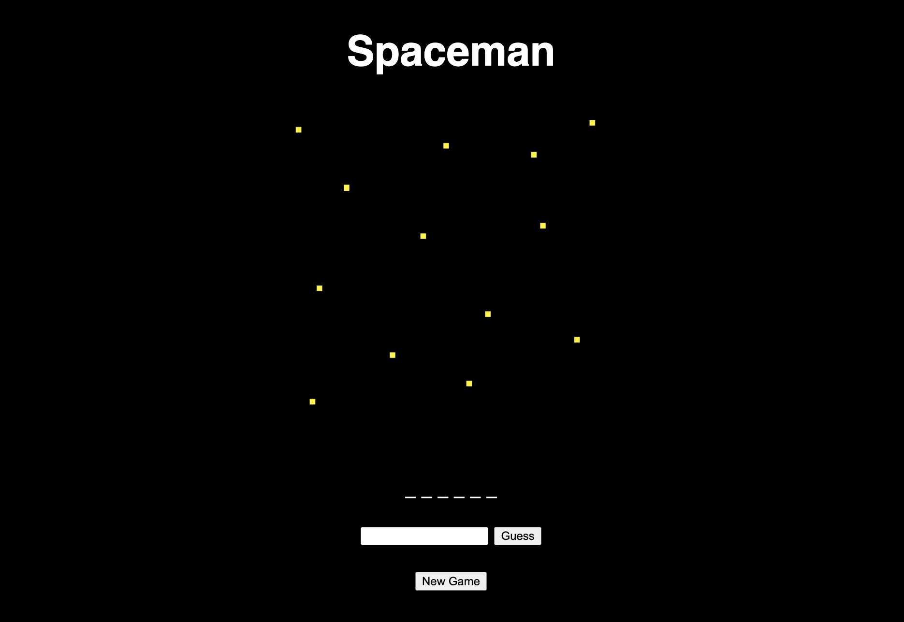
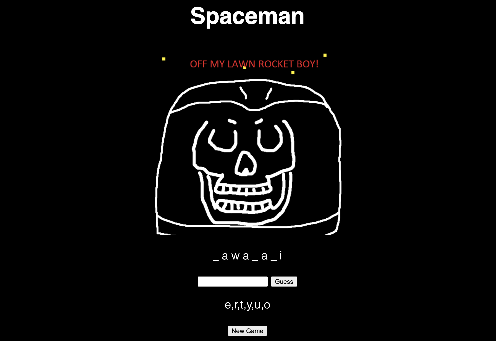

# Spaceman

Spaceman is a game where you have to guess a word before the spaceman is drawn.

## Technologies used

The following technologies were used to build this project:
- JavaScript
- HTML
- CSS

## Getting started

To play this game you can click this link: [Spaceman](https://lewisgraves.github.io/project-1/)

Instructions:

- Type a letter into the input box
- Click the "Guess" button to submit your guess
- If the letter is in the word it will be displayed in the correct place
- If the letter is not in the word it will be displayed in the incorrect guesses box
- If you guess the word correctly you win
- If you guess the word incorrectly 6 times you lose

## Next steps

Version 2 will:
- As a player i would like a hint button
- As a player i would like to have a category selector

Version 3:
- As a user I would like to be able to choose a difficulty level
- As a player I would like to see a win or loss animation