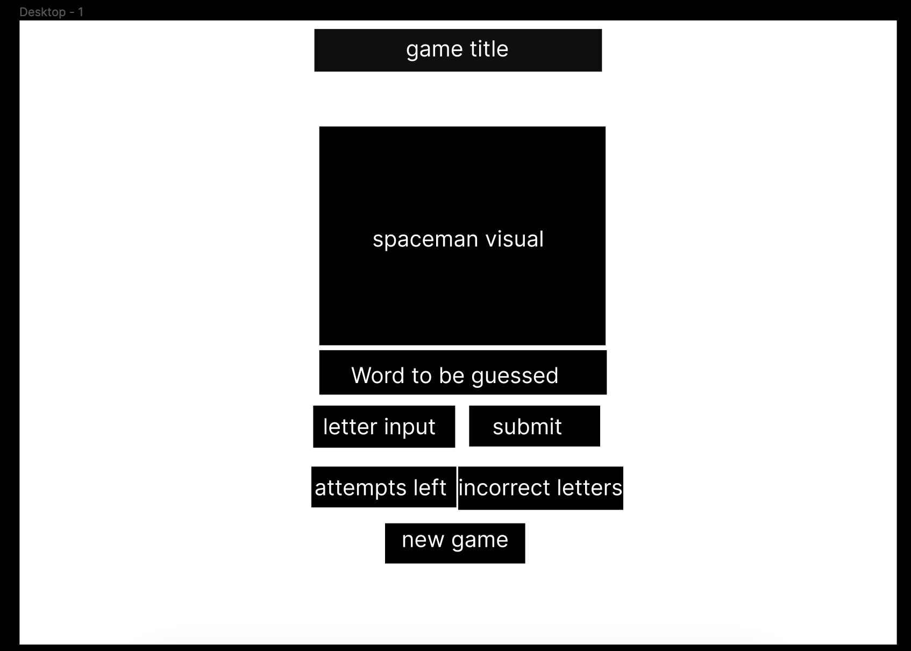
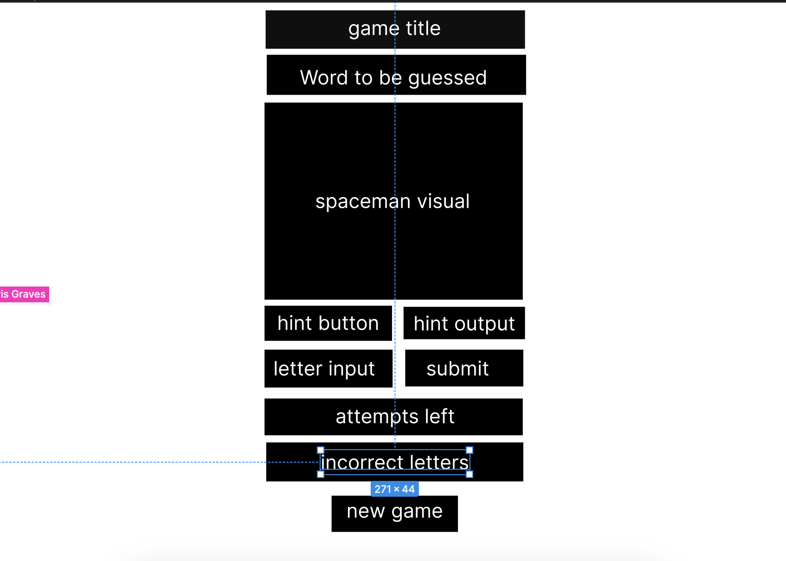
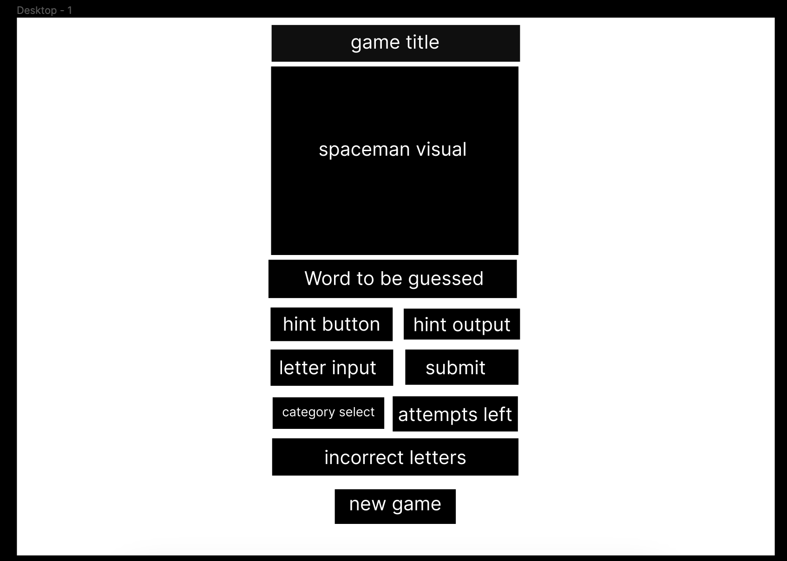

# Spaceman

A cleaned up version of hangman that doesnt depict an execution.

## MVP

#### wireframe

#### User stories

- As a user I want to be able to play a game of "spaceman"

        const wordBank = ["word1", "word2", "word3"]

        let random = Math.floor(Math.random() * wordBank.length)

        const images = ["image1", "image2", "image3"]

        let word = wordBank[random]

        let userInput = ""

        let attempts = 6

        let incorrect = []

        let imagestep = images[0]

- As a user I want to be able to see the word I am trying to guess
- As a user I want to see the spaceman
- As a user I want to be able to guess a letter
- As a user I want to be able to see the letters I have guessed incorrectly
- As a user I want to be able to see the letters I have guessed correctly
- As a user I want to see the number of attempts I have left

    
    for loop to create underscores for word

    function to check if letter is in word
    if letter is in word
        replace underscore with letter
    else
        add letter to incorrect array
        subtract 1 from attempts
        change image to next image

    function to check if word is guessed
    if word is guessed
        alert "you win"
    else
        alert "you lose"

    function to check if any attempts are left
    if attempts are left
        continue game
    else
        alert "you lose"

- As a user I want to be able to start a new game

    
    function to start new game

        reset attempts

        reset incorrect array

        reset word

        reset underscores

## version 2

#### wireframe

#### User stories

- As a user I want to be able to see a picture of spaceman
- As a user I want to be able to see a picture of spaceman change as I guess incorrectly
- As a user I want to be able to get a hint for the word

## version 3

#### wireframe

#### User stories

- As a user I want a animation to play when I win or lose
- As a user I want to be able to pick a difficulty level
- As a user I want to be able to choose a category for the word